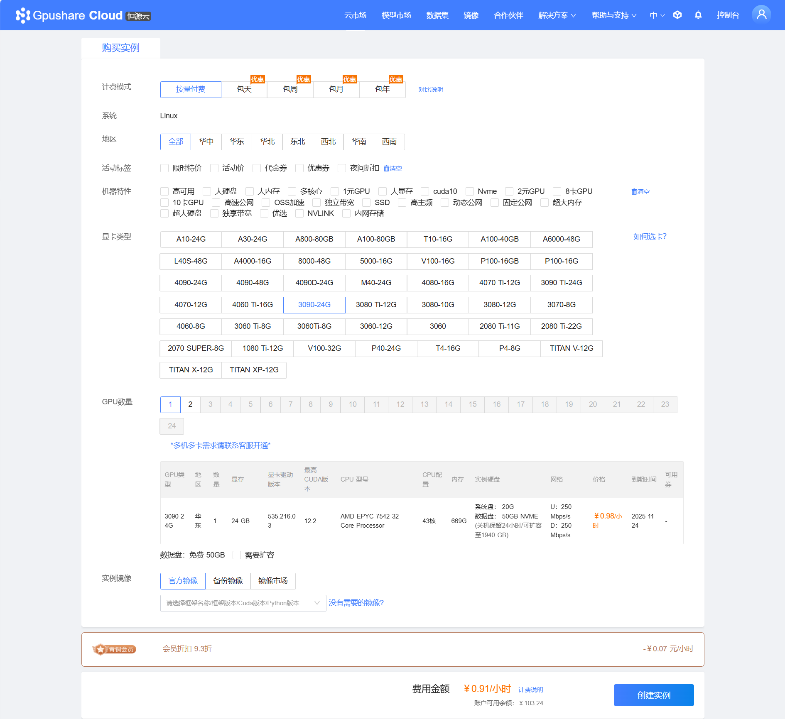
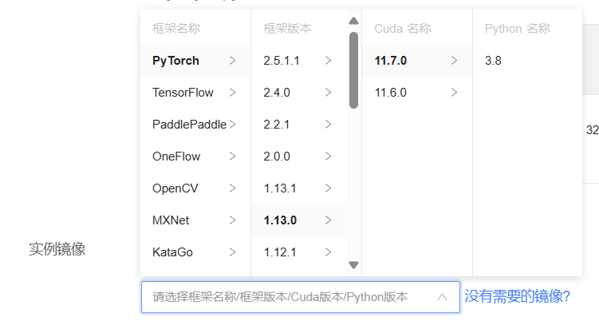
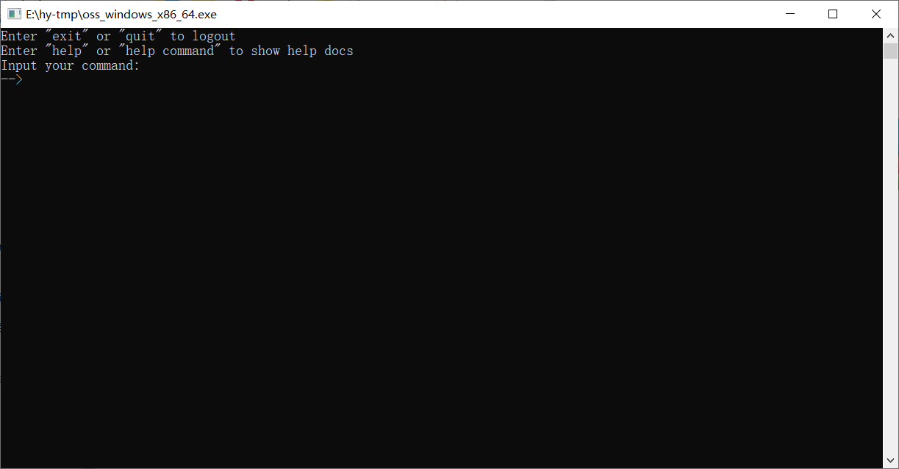
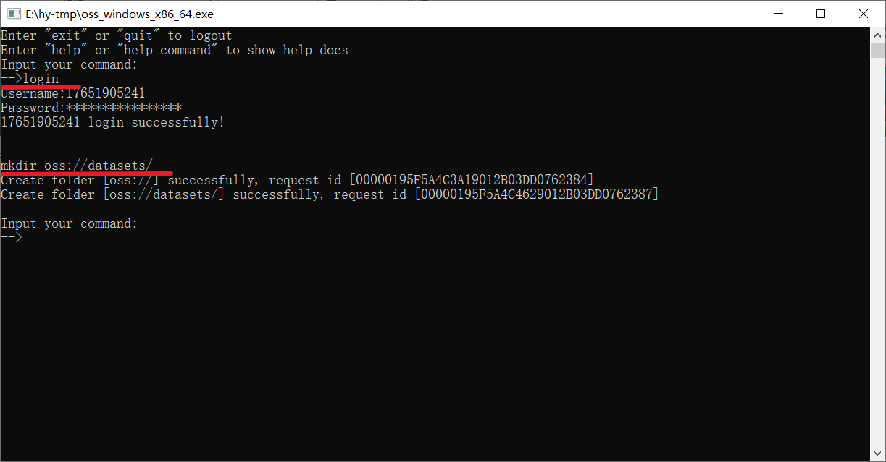
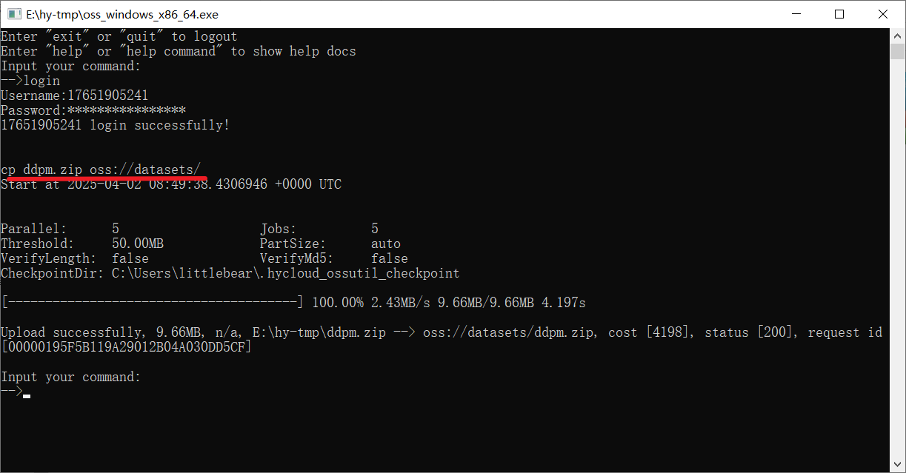
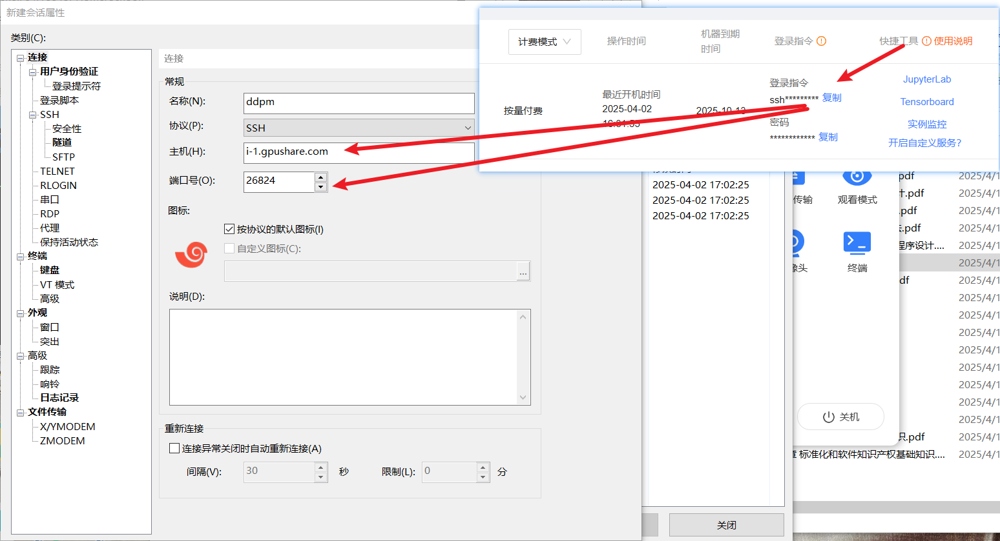
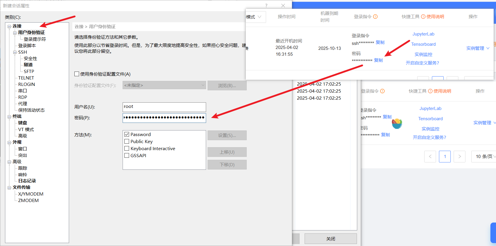
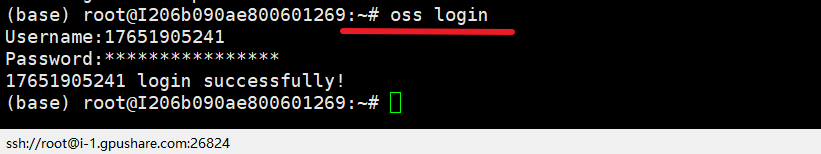
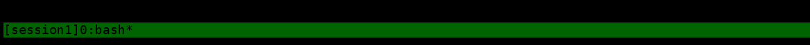

# 恒源云 GPU 使用流程

作者：Redgood Xu

## 写在前面

> 我们一般用云GPU来训练自己的神经网络通常需要这几个步骤。
>
> 1 创建实例；
>
> 2 准备好自己的数据(项目和数据集)；
>
> 3 将自己的数据上传到实例中；
>
> 4 训练神经网络；
>
> 5 得到权重文件和一些结果文件；
>
> 6 将结果从实例下载到本地。

## 1 创建实例

> 进入恒源云这个平台之后 会直接出现一个实例市场页面(如图)



> 之后选择自己所需要GPU型号和所需要的框架和环境。
>
> 这里笔者选择的是GPU3090 24G，官方镜像为pytorch: 1.13.0, CUDA: 11.7.0, Python: 3.8



## 2 准备自己的数据(项目和数据集)

> 这里没什么可写的， 将自己的项目和数据集打包成压缩包即可。

## 3 上传数据

> 推荐使用OSS命令来上传数据 [关于OSS下载 恒源云里面提供了不同操作系统的下载方式]

> 这里笔者下载的是Windows操作系统，如图所示，下载完成并打开。



> 1) 执行登录命令
>
> ```oss
> longin
> ```
>
> 2) 创建命令
>
> ```oss
> mkdir oss://datasets/
> ```
>
> 这样在平台的“我的数据”中就成功创建了一个名为datasets的文件目录，方便之后上传文件。



> 3) 将自己的数据文件传入到这个文件目录，笔者的文件目录是“ddpm.zip”
>
> ```
> cp ddpm.zip oss://datasets/
> ```
>
> 这个命令就是把ddpm.zip这个本地文件 上传到了平台的datasets这个文件目录里面了。
>
> 注意这里ddpm.zip是根据你下载的oss.exe文件的路径，当然你可以用绝对路径。



> 4) 解压文件
>
> 连接实例(可以直接使用实例的提供的JupyterLab，也可以通过XShell进行连接)
> 推荐用XShell，这样后续训练比较稳定。

> 这里补充一下用XShell连接实例
>
> 1） 打开XShell8 (Free for Home/Schol) -> 文件 -> 新建
>
> 2） 将实例登录指令那一块复制到主机上(会显示端口和主机)，把端口号写下下面，起一个自己喜欢的名称；



> 3） 点击“用户身份验证”，将登录指令的密码复制到密码处，用户名填写root即可
>
> 4） 点击确定并进行连接，之后会弹出来一个窗口，点击全部接受，即可成功连接。



> 我们回到数据上传这里，现在我们已经把数据上传到我的数据里面了(注意这个是收费的，如果哪天不需要了一定要即使删除掉)。接下来就是要把数据弄到实例里面去。
>
> 1） 登录账号
>
> ```oss
> oss login
> ```
>
> 之后输入自己的密码即可



> 2） 将我的数据里面的压缩包上传到实例指定的文件目录
>
> ```oss
> oss cp oss://datasets/ddpm.zip /hy-tmp/
> ```
>
> 这个命令就是将我的数据里面datasets文件目录下的ddpm.zip这个压缩包上传到了实例里面的/hy-tmp/文件目录中


> 3 ) 解压缩
>
> ```oss
> unzip ddpm.zip
> ```

## 4 训练神经网络

> 经过上述的步骤，我们已经成功将数据上传到实例中并成功解压缩了。
>
> 这样就可以运行你的train.py文件了
>
> ```oss
> python train.py
> ```
>
> 具体的训练命令具体使用，这里我只是举个例子，因为有很多命令会带有附加的参数可供选择的。

> 这里我建议训练的时候可以使用一下tmux这个命令，官方的文档也说明了。
>
> Tmux 是一款可以管理会话和分屏的终端复用器。在远程 SSH 断开后可以继续执行任务，重新连接后再继续会话。也能够将进程放到后台运行，需要时重新接管。为了防止 SSH 因网络断开造成的进程运行中断，推荐把所有需要长期运行的训练等任务都使用 Tmux 终端。
>
> 简单来说就是训练时间很长的话，可以使用Tmux，非常不错，笔者亲测。
>
> ```linux
> tmux new -s session1
> ```
>
> 这个命令就是开启一个名称为session1的会话，然后在这里面执行训练命令即可。



## 5 得到权重文件和一些结果文件

> 通常我们训练深度学习的项目，一般都要得到权重文件和一些结果的。
>
> 这里笔者就是得到了不同epoch的权重文件和一些结果图像(CV领域)
>
> 通常权重文件会保存在指定文件目录里面，例如“weight”或者“ckpt”等等，结果会保存在“result”文件目录。
>
> 我们需要将这些结果打包成压缩包
>
> ```
> zip -q -r result.zip result
> ```
>
> 这个命令就是将result这个文件打包成result.zip压缩包

## 6 将结果从实例下载到本地

> 这一步非常关键，我们得到了我们期望的结果和模型，肯定要把它们拿回到本地也就是我们的电脑上的。
>
> 其实这一步的步骤也上传数据那一步很相似，它的逻辑就是先从实例中下载到我的数据里，然后再从我的数据里面下载回本地电脑。
>
> 0）登录
>
> ```linux
> oss login
> ```
>
> 1）从实例中下载到我的数据里
>
> ```linux
> oss cp ckpt.zip oss://datasets/
> ```
>
> 这一个命令就是将实例中的ckpt.zip这个命令 下载到我的数据里面的datasets文件目录下


> 2） 利用本地的oss.exe 将我的数据里面的权重文件下载到本地中
>
> ```linux
> cp oss://datasets/ckpt.zip ./
> ```
>
> 这个命令就是将ckpt.zip下载到本地
>
> 这里./是相对路径，相对的是oss.exe这个文件（我这里是专门用了一个文件目录里面放oss.exe这个文件，然后保存文件，直接保存到这个文件目录里面了，方便一些）


> 至此就完成了整个流程！！！